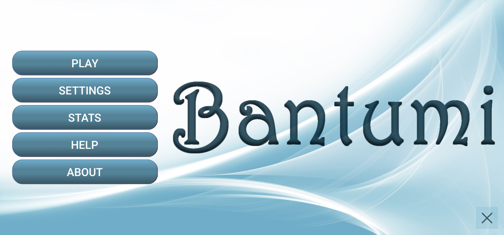
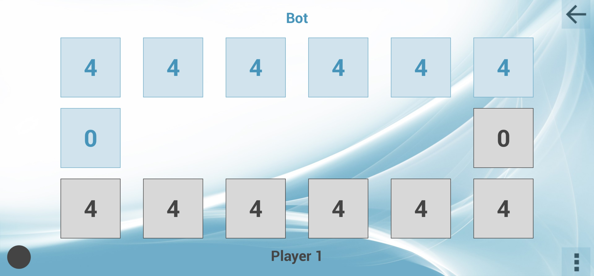
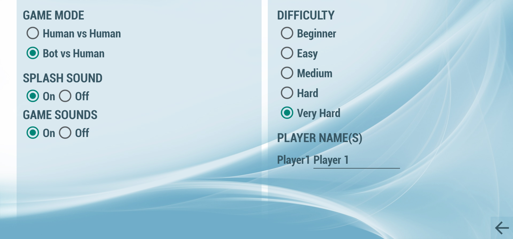
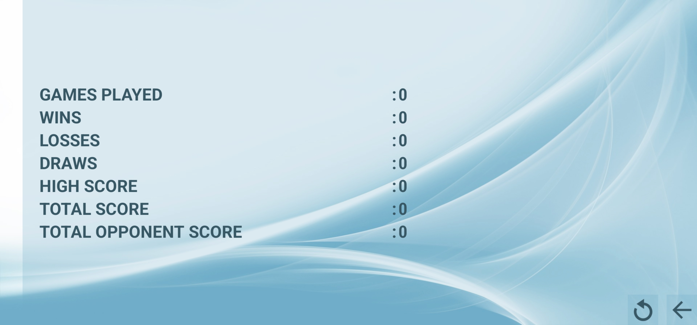
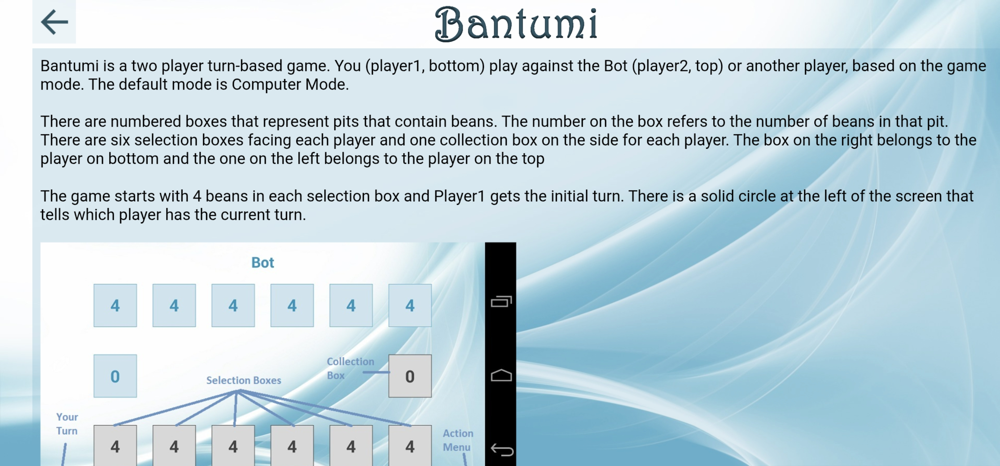

# Bantumi

> A Mancala board game for Android with an AI opponent — live on Google Play for 10+ years, 4.7 stars across 126 reviews.

---

## What It Is

I first encountered this game in the Nokia Handset 3310.

*Bantumi on a Nokia 3310 — the original*

Bantumi is my Android implementation of Mancala — a two-player turn-based board game where you and an opponent (human or AI) take turns distributing beans across pits, trying to collect the most in your store. The game goes by many names across cultures — Pallanguzhi in Tamil Nadu, Vamana Guntalu in Telugu, Ali Guli Mane in Kannada, Bantumi on Nokia phones. The rule-set I implemented is **Kalah**, the variant Nokia bundled on their handsets.

Before app stores existed, games shipped pre-installed on phones. Bantumi was one of them — bundled on Nokia handsets like the iconic 3310, alongside Snake and a handful of other titles, it was part of the first wave of games a generation played on mobile.

My connection to this game goes back to 2003, when I wrote a basic C version as a personal project. It worked, but it had no AI — just the mechanics. I always wanted to take it further. Years later, when I picked up Android development, Bantumi was the project I kept coming back to. Rebuild it properly. Add an AI opponent that could actually challenge you.

The Android version shipped in August 2014. It supports both Bot vs Human and Human vs Human modes, five difficulty levels, and runs on Android 5.0 (Lollipop) and above — currently targeting API 36.

## Play Store

[**Download on Google Play →**](https://play.google.com/store/apps/details?id=com.gvs.bantumi)

---

## Screenshots

<table>
  <tr>
    <td align="center" width="50%"> <em>Splash — launch screen with version</em></td>
    <td align="center" width="50%"> <em>Main menu</em></td>
  </tr>
  <tr>
    <td align="center" width="50%"> <em>Game board — opening position</em></td>
    <td align="center" width="50%"> <em>Settings — difficulty and game mode</em></td>
  </tr>
  <tr>
    <td align="center" width="50%"> <em>Stats — games played, wins, losses, scores</em></td>
    <td align="center" width="50%"> <em>In-app help — move types explained</em></td>
  </tr>
</table>

---

## Architecture

The codebase splits into two top-level packages. **`platform/`** carries the rules, AI search, player abstractions, game state, and move executor — zero Android dependencies, pure Java, compiles without `android.jar`. **`android/`** holds everything that touches the SDK: activities, the custom Canvas renderer, SharedPreferences, lifecycle wrappers. The split wasn't there on day one — it landed in Aug 2020 in a single commit that moved ~75 files, and it's the single decision that bought the most maintainability across every toolchain and API change since.

[→ Full architecture overview](docs/architecture.md)

---

## The AI

The AI opponent is built on minimax with alpha-beta pruning. On its turn, it searches the game tree up to a configurable depth — five difficulty levels from Beginner to Very Hard — evaluating positions by a weighted score of seeds in the store versus seeds still in play. Bonus turns, where landing on your store earns another move, are explored at the same depth rather than consuming it, so the AI never undervalues chain opportunities. Beginner through Easy respond in under a second; Very Hard tops out at around 10 seconds on older devices.

[→ Full AI algorithm write-up](docs/ai-algorithm.md)

---

## The Long Arc

The repo has over 80 commits across bursts separated by long silences — the longest nearly three years with no code changes while the app ran, accumulated ratings, and reached the Top 500 in 38 countries. Three big inflection points along the way: **Eclipse → Android Studio (2016)**, **the `platform/android` split and three AI engines collapsing to one (2020)**, and **API 36 / `minSdk` 21 modernisation (2025)**. Everything else is compliance maintenance. The app on the Play Store today still runs the minimax-with-alpha-beta engine that landed in August 2014.

[→ Full evolution write-up](docs/evolution.md)

---

## Stats

| Metric | Value |
|---|---|
| Rating | 4.7 ★ |
| Reviews | 116 |
| On Play Store since | Aug 31, 2014 |
| Current version | 1.1.13.54 |
| Target SDK | API 36 |
| Minimum SDK | API 21 (Android 5.0 Lollipop) |
| Best ranking — India | **#224** in Top Free Board Games (Aug 18, 2014) |
| Best ranking — Global | **Top 500 in 38 countries**, Top 1000 in 41 countries |
| Best ranking — Play Store chart | **#287** in Top Free Board Games (in-store) |

Ranking proof

---

## Why This Matters

Most of what I've built in my career is enterprise software — invisible, under NDA, undemonstrable. Bantumi is the exception. Public. Judged continuously by strangers I'll never meet. Still running on the fundamentals I wrote as a first-time Android developer.

Years on the Play Store. Android 4.0 floor through API 36. 4.7 stars across 126 reviews. The AI, the game rules, the architecture — they held.

I don't point to this because it was brilliant. I point to it because it was mine, it worked, and after a career of building things I couldn't show anyone, that turns out to matter.
