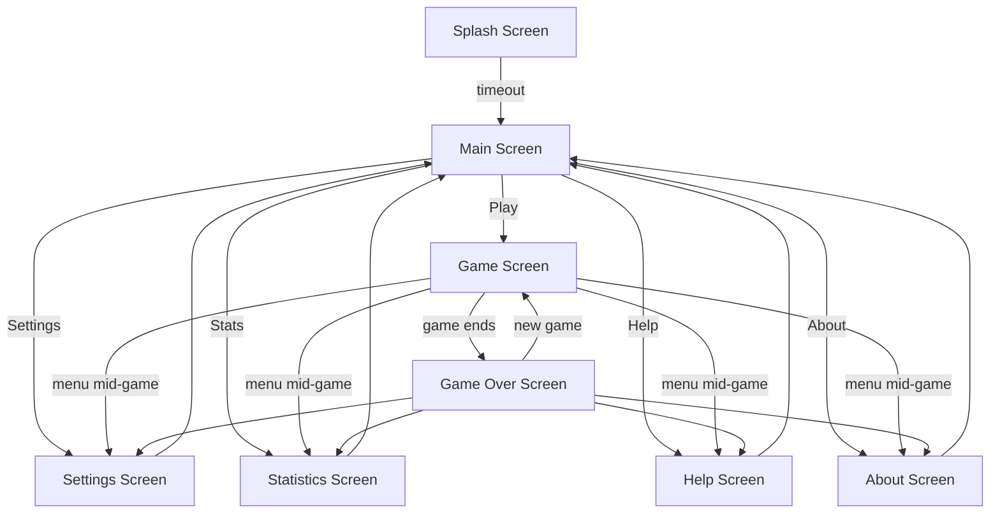

# Architecture

## Screen Flow

Before the game-internal architecture, here's how the app hangs together at the screen level.



**Splash.** Plays only on first launch, or on a clean launch after the user exited from the Main screen. Normal backgrounding and resuming — a phone call, switching apps — does not replay the splash.

**Main.** The hub. Five entry points: Play, Settings, Stats, Help, About.

**Game.** The board. Mid-game, the user can open Settings, Stats, Help, or About from the menu without losing state.

**Game Over.** Terminal screen for a finished match. From here the user can start a new game directly or jump to any of the other screens — they don't get routed back through Main.

### Game state is durable

Game state is persisted any time the user leaves the Game screen — whether by navigating away or by Android suspending the activity for a call, a notification, or a context switch. On return, the user is offered a choice: **resume** the in-progress game, or **restart**. The durability is deliberate — a ten-minute match against Very Hard should survive a phone call.

---

## Package Structure

The Studio codebase has two top-level packages:

- **`platform/`** — game rules, board state, player abstractions, move execution, the AI search. Zero Android dependencies. Pure Java.
- **`android/`** — activities, views, lifecycle wrappers, SharedPreferences, the custom Canvas renderer. Everything that touches the Android SDK lives here.

The `platform/` package compiles without `android.jar` on the classpath. No `import android.*` anywhere in it.

### Why the split exists

The split was driven by a specific problem: tuning the AI. The minimax evaluator weighs seeds in the store against seeds still in play, and the right weights had to be found empirically — thousands of bot-vs-bot games, measured win rates, no UI in the loop. That experiment needs the engine to run as a plain Java main method, not inside an Android activity. So the engine was pulled out. [→ Details in the AI write-up](ai-algorithm.md).

### What it bought afterwards

The separation started as a means to an end. It turned out to pay off for a decade:

1. **The AI is testable in plain JUnit.** A minimax bug is a unit test, not a device session.
2. **Android SDK churn doesn't touch game logic.** API 20 to API 34, AndroidX, new permission models, background-execution limits — the rules of Kalah never had to be re-verified against any of it.

### What came before

This was not day-one. The original Eclipse codebase mixed `android.os.Handler`, `android.util.Log`, and `android.content.Intent` into the engine path — standard for a first Android project in 2014. The clean separation was carved out during the migration to Android Studio, when the tuning work forced the question.

---

## Key Abstractions

Three abstractions carry the weight of the game: the **Player**, the **Game State**, and the **Move Executor**. Each has a reason to exist that became obvious only after the first version was running.

### Player Hierarchy

```
Player (interface)
    └── AbstractPlayer
            ├── HumanPlayer      — waits on touch events
            ├── MachinePlayer    — runs minimax, returns a move
            └── SimulationPlayer — plays inside the AI's search tree
```

The `Player` interface exposes one essential question: *given this board, what move do you want to make?* Everything else — whose turn, how the UI reacts, whether this is a real game or a hypothetical one — lives outside.

`AbstractPlayer` holds the shared bookkeeping: which side of the board is mine, my name, my store. Subclasses fill in only the decision logic.

**Why `SimulationPlayer` exists.** When `MachinePlayer` runs minimax, it needs to ask *"what if Human plays move X, then I play Y, then Human plays Z…?"* The lookahead happens on a hypothetical board. You can't reuse `HumanPlayer` for that — there's no human to touch the screen. `SimulationPlayer` is a stand-in that plays both sides silently inside the search tree, so the real game state stays untouched while the AI thinks.

### Game State

```
GameState            — the rules + the current board
    ├── GamePlayState    — real game: whose turn, move history, settings
    └── SimulationState  — hypothetical game: used only inside minimax
```

`GameState` is the shared substrate — pits, seeds, stores, whose side is whose. `GamePlayState` adds what a real match needs: turn tracking, listener hooks, save/restore. `SimulationState` is the stripped-down version the AI clones and mutates while searching, with no listeners and no persistence.

Keeping them separate means a minimax recursion can't accidentally fire a UI callback or trigger a save. The types enforce it.

### Move Executor

One copy of the Mancala rules exists in the codebase: `AbstractMoveExecutor`. Pick a pit, sow the seeds anti-clockwise, handle bonus turns when you land in your store, handle captures when you land in your empty pit — all of it lives in one place.

It has two subclasses that differ only in context, not in rules:

- **`GameMoveExecutor`** — executes a move on the real board, animated, with listener callbacks firing as seeds drop.
- **`MachineMoveExecutor`** — executes the same move on a simulation board, silently, at full speed, inside the AI search.

If the rules of Kalah ever needed to change, there would be exactly one class to edit. The display path and the simulation path would stay in sync automatically.

---

### Patterns in hindsight

I didn't build this with a pattern catalogue open. The shapes came from working through what the code needed. The names I'd use for them now:

| Shape in the code | Name it has |
|---|---|
| `Player` interface with swappable implementations | **Strategy** |
| `AbstractPlayer` / `AbstractMoveExecutor` with subclasses filling in specifics | **Template Method** |
| Board and player state snapshotted, mutated during search, restored after | **Memento** |
| Listener callbacks from engine to view | **Observer** |
| One rule implementation, one reason to change | **Single Responsibility** |
| `GameMoveExecutor` vs `MachineMoveExecutor` — same rules, different context, no fork | **Open/Closed** |
| Any `Player` subclass substitutes cleanly for any other | **Liskov Substitution** |

The value isn't that I can name them. The value is that even in the initial stages of designing the app, I arrived at these shapes by reasoning about the problem — and the shapes held for a long time without much rewrite.

---

## Threading Model

The game runs on its own thread — not the Android main thread.

The game loop asks the current player for a move and blocks until it gets one. For `HumanPlayer`, that block resolves when the user taps a pit. For `MachinePlayer`, it resolves when minimax returns — which can take up to roughly ten seconds on Very Hard on older hardware. Either way, the game thread sits and waits. No polling, no timers.

Keeping this off the main thread matters. A ten-second block on the UI thread is an Application Not Responding dialog. A ten-second block on the game thread is the AI thinking.

**While the AI thinks.** A separate animator — `MachineThinkerAnimator` — spins its own thread to drive a rotating arc indicator on the UI. The user sees motion, knows the app is alive, and the main thread stays free to handle system events. The animator stops when the AI returns a move.

**UI updates.** The engine emits events as a move plays out — a seed dropped here, a capture there, a bonus turn earned. The view listens, receives the callbacks, and calls `invalidate()` to trigger a redraw on its own thread. The engine never touches the view directly.

---

## Persistence

All persistence goes through `SharedPreferences`. Three stores, each with its own lifetime and its own reason to change:

| Store | Holds | Written | Read |
|---|---|---|---|
| `BANTUMI_SETTINGS` | difficulty, game mode, capture variant, UI preferences | when the user changes a setting | on app launch |
| `BANTUMI_STATE` | current match: board, whose turn, move history | on `onPause()` and on significant moves | on `onResume()` if a match is in progress |
| `BANTUMI_STATS` | cumulative wins, losses, games played per difficulty | at the end of each completed match | when the Stats screen opens |

The segregation isn't cosmetic. Settings and stats survive forever. An in-progress match is ephemeral — it gets cleared when the user finishes the game or explicitly restarts. Mixing the three into one store would mean every write has to worry about every lifetime. Splitting them means each store has one reason to change.

The save-on-pause / restore-on-resume cycle is what makes the "resume or restart?" dialog on the Game screen work. Whether the user backgrounded the app for a phone call or deliberately walked away, the game is still there when they return.

---

## Rendering

The board is not an XML layout. It's a single custom `View` subclass — `GameBoardView` — that draws directly to a `Canvas`.

XML-based layouts with nested ViewGroups would have worked, technically. They would also have fought me at every turn — twelve pits, two stores, animated seeds dropping, a "thinking" arc overlaying the bot's side, aspect ratios varying from a 320-wide QVGA phone in 2014 to a 1440-wide tablet today. Every one of those is a pain in layout XML and a half-page method in Canvas.

So the whole board is computed from first principles each draw: measure the view's dimensions, lay out pit positions as rectangles, draw circles for seeds, draw text for counts. The layout math is a function of `onSizeChanged()` inputs. No density buckets, no `-sw600dp` resource variants for the board itself — it just scales.

The AI's thinking indicator — the rotating arc — is composited on top of the same canvas, driven by `MachineThinkerAnimator`'s separate thread posting invalidation requests. When the AI returns, the animator stops and the arc disappears on the next draw.
