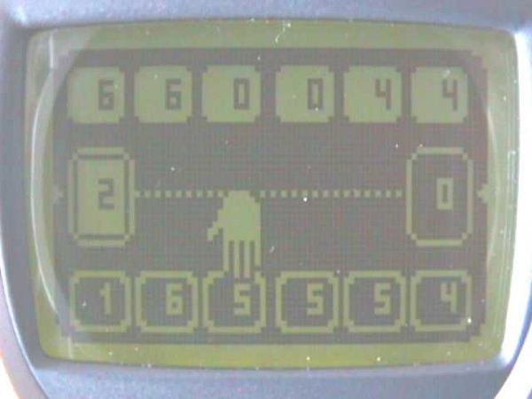
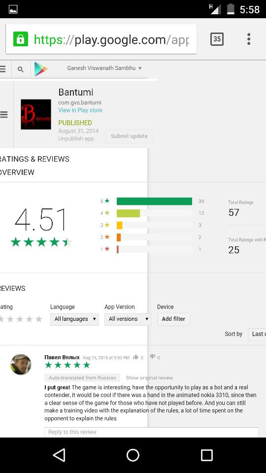
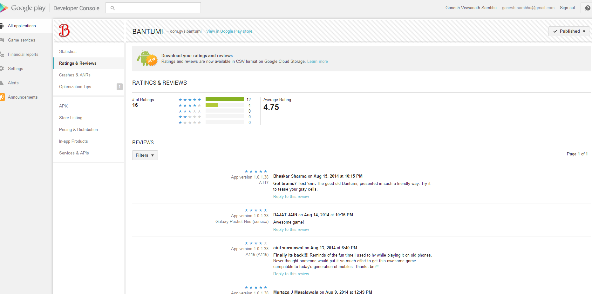
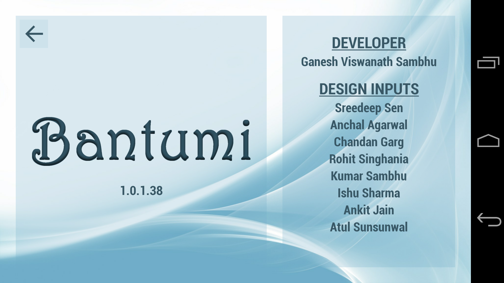
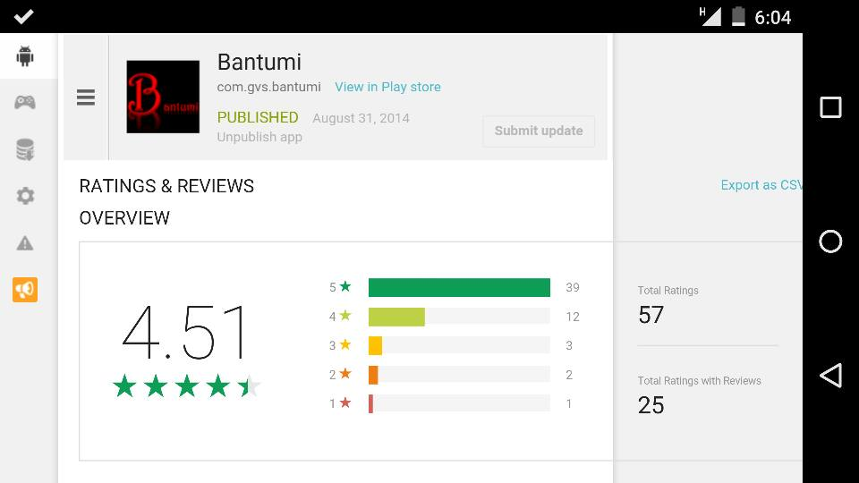
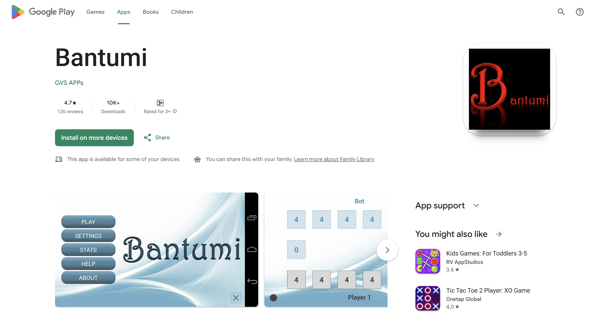

# The Long Arc



The game on the phone above is Bantumi on a Nokia 3310, circa 1999.
Monochrome LCD, a hand cursor picking a pit, six pits per side, two
stores. That's the app I was rebuilding fifteen years later. The rules
haven't changed; only the glass has.

## The Shape of It

Bantumi has been on Google Play since August 31, 2014. The repository has
over 80 commits to its name — the work came in bursts, separated by long
stretches of nothing at all.

| Year | Commits | What happened |
|------|---------|---------------|
| 2013 | 6 | Eclipse check-in, first tagged build |
| 2014 | 24 | Pre-launch build-up. Three AI engines land. **First Play Store release (Aug 31).** |
| 2015 | 0 | Silent. App live on 1.0.3.40. |
| 2016 | 14 | Eclipse → Studio. Gradle. Wrapper refactor. 1.1.0.41. |
| 2017 | 1 | `bantumiEngine/` — the bot-vs-bot tournament framework. |
| 2018 | 0 | Silent. |
| 2019 | 0 | Silent. Offline tournament runs happening in the background. |
| 2020 | 20 | **The rewrite.** `platform/` split. Tuned weights ship. Three engines → one. |
| 2021 | 1 | Just an apk drop. |
| 2022 | 0 | Silent. |
| 2023 | 0 | Silent. |
| 2024 | 2 | AAB cutover. 1.1.9.50. |
| 2025 | 6 | API 36 era. 1.1.10.51 → 1.1.13.54. |

The silences aren't neglect — they're the credibility signal. The longest
stretch, July 2017 to July 2020, is almost three years with no code
commits. Throughout that window, the app was live, downloaded, rated
4.7 ★ across 126 reviews, and charted on two independent boards:

**AppAnnie — #224 in India's Top Free Board Games (Aug 2014), Top 500 in 38 countries.**


**Google Play — #287 in the Top Free Board chart.**



Two different listings, same message. None of it needed a commit. The
shipped code was enough.

That's what "it held" looks like in practice. The rating chart is dated,
the commit log is sparse, and the two match.

---

## Era 1 — Build-up to First Ship (2013 – Oct 2014)

The earliest commits are an Eclipse project. `Bantumi/.classpath`,
`AndroidManifest.xml` at the top, `src/com/gvs/bantumi/*` mixed together —
activities, engine, screen, utils all in one flat package tree. That was
normal for a 2013 Android project; this was my first one.

The first tagged build (**1.0.13**, July 2013) added the Roboto font
family and background music. Over the next twelve months, the app filled
out: Help screen with illustrated pages, Settings/Options, Stats, About,
the nine-patch drawables, the custom dialogs, density buckets for every
screen size from sw320dp up to sw720dp.

The two commits that matter most in this era are **three days apart** in
late July 2014:

- **2014-07-30 (build 35).** `MachineEngineImpl` gets renamed to
  `MachineEngineInitialImpl`. A new `MachineEngineMinimaxImpl` lands
  alongside it. An enum `MachineEngineMode` picks between them. A new
  lightweight `SimulationState` joins `GameState` — cloned and mutated
  inside search, no listeners, no persistence.
- **2014-08-07 (build 36).** `MachineEngineAlphaBetaImpl` lands. A third
  engine, in parallel. `MachineThinkerAnimator` lands the same day — the
  rotating arc that gives the UI something to show while the bot thinks.

Why three engines shipping in parallel rather than picking one? I wasn't
ready to delete the earlier two. The heuristic engine had bootstrapped the
evaluation function. The plain minimax was how I verified that alpha-beta
wasn't changing move choices, only pruning nodes. Keeping all three running
behind a mode switch gave me an A/B harness while I was still unsure which
was correct. That confidence wouldn't arrive for another six years.

The app shipped on **August 31, 2014** as 1.0.2.39. A single cleanup
commit in late October (1.0.3.40) closed out the year.

The first two weeks of reception: **4.75 ★ across 16 ratings**, reviews
from real users on real hardware (Galaxy Pocket Neo, mid-range Android
phones of the day).



### The pre-launch testers

The About screen carries a credits list that has been in the codebase
since the first Eclipse check-in. It's the friends who ran pre-launch
builds on their own phones — different Android versions, different
screen densities, different carriers — and told me what broke.



No automated device farm, no Firebase Test Lab, no internal-track
rollout. Eight phones in eight pockets around me. Every crash report in
that era came from one of them. The list has stayed in the About screen
unchanged through every refactor since — Eclipse, Studio, the
platform/android split, AAB, API 36. They earned the spot.

---

## Era 2 — The Silent Year (Nov 2014 – May 2016)

Nineteen months with no commits. The app was live on 1.0.3.40, accumulating
ratings. By August 2015 — a year after launch, with no code changes in
between — the rating was sitting at **4.51 ★ across 57 ratings**, picking
up reviews in Russian, German, and Spanish as the app found audiences I
hadn't marketed to.



One review that month landed the same day I mentioned the app in passing
to a senior leader three levels above me at work — five stars, "Nice
game, enjoying playing it." I hadn't asked him to install it. The
unprompted same-day pickup from someone whose time is genuinely scarce
was its own small signal: the app was passing the "would a busy senior
person actually install this and play it right now?" test.


This is the first proof-point for something I only understood later: if
the fundamentals are right, you don't need to be there every week. A
game whose rules have been fixed since the Nokia 3310 and whose board
doesn't depend on any Android API beyond `Canvas.drawCircle()` doesn't
churn.

---

## Era 3 — The Rewrite (2016 – 2020)

This is the meat of the story, and it's a long one. I'll compress.

### Eclipse → Studio (May – Jun 2016)

Google announced end-of-life for the Eclipse Android tooling. I couldn't
ignore it. Over about a week in late May 2016, the project was lifted
into a sibling folder `BantumiStudio/`, migrated to Android Studio's
`app/src/main/{java,res,assets}/` layout, and switched from Ant to Gradle.
Every source file got renamed. `.project` and `.classpath` were deleted.
`gradlew` and `gradlew.bat` appeared. `.idea/*.xml` got tracked (and
untracked again four years later).

What broke: essentially nothing, if you squint past the file paths.
Gradle's first build succeeded after the `AndroidManifest.xml` version
was fixed. The code itself — the engine, the view, the activities — ran
unchanged. That's the payoff for keeping dependencies shallow in 2014:
you don't pay when the tooling underneath you is replaced.

### The wrapper pattern (July 2016, 1.1.0.41)

A mid-sized refactor introduced a `wrapper/` package:
`HandlerWrapper`, `GameOverIntent`, `GameOverIntentFactory`,
`SoundProvider` — interfaces, plus Android implementations kept separate.
The engine code was starting to depend on interfaces instead of
`android.os.Handler`, `android.content.Intent` directly. This wasn't yet
the platform/android split — it was the tooling-up for it.

At the same time, the `MovesCalculator` → `MoveCalculator` package got
cleaned up (just the extra 's' dropped), and a new
`AbstractMachineEngine` base class was introduced to hoist shared code
out of the three engine impls.

### The 2017 experiment

On **July 19, 2017**, a single commit added `bantumiEngine/Existing/` —
an entire parallel copy of the project, with one meaningful addition:
`research/GameTest.java`. This wasn't a dead-end backup. This was the
bot-vs-bot tournament framework — a plain Java main method that could
instantiate two `MachinePlayer`s with different `EngineParameter`
configurations, play thousands of games between them, and record win
rates. No UI, no emulator, headlessly.

The code to run the tournaments exists. The analysis outputs that came
out of them don't — they were ad-hoc Java main runs, not checked in.
But the result of the analysis did land, three years later, as the
weight table that shipped.

### What the analysis actually looked for

The `EngineParameter` surface was broader than the two terms that finally
shipped. At various points during tuning, it carried:

```
totalWeight, mainWeight
bonusWeight, bonusAlpha, bonusBeta
grab1Weight, grab1Alpha, grab1Beta
grab2Weight, grab2Alpha, grab2Beta
```

Nine parameters beyond the two. `bonus*` rewarded positions one move from
landing in your own store (a bonus-turn setup). `grab1*` and `grab2*`
rewarded capture-threat positions one and two moves out. Each term had
its own weight plus alpha and beta shaping coefficients.

I tried them. The tournament results across a grid of (difficulty level,
turn) cells didn't justify keeping them. Inside the plateau I've written
about in the AI doc, the richer evaluator matched or lost to the
two-term one. The additional parameters didn't pull the plateau higher —
they just widened the search space for tuning without a corresponding win.
So I fell back to `totalWeight` and `mainWeight` alone. The richer
parameters stayed on the `EngineParameter` interface as vestigial fields
for a while longer, wired to zero weights, before being trimmed.

The lesson I took: a simpler evaluator with well-tuned weights beat a
richer evaluator I couldn't tune confidently. Not in theory — in
measured win rates. When I write in the AI doc that two terms were
"enough," that's what I mean. It's not that I didn't look; it's that I
looked and the data said so.

### The 2020 burst (Jul – Sep 2020)

Twenty commits in two months. The shape:

1. **2020-08-11 (1.1.1).** Engine subdivided into `engine/game/` and
   `engine/machine/`. Housekeeping.
2. **2020-08-19.** The `platform/` split. One commit touching ~75 files.
   Every non-Android class moved to `platform/*`; every Android class
   moved to `android/*`. `GameScreen` became `GameBoardView`.
   `MoveCalculator` became `MoveExecutor`. The engine impls got renamed
   `AlphaBetaMachineEngineImpl` / `MinimaxMachineEngineImpl` /
   `InitialMachineEngineImpl`. After this commit, `platform/` compiled
   without `android.jar` on the classpath. (The architecture doc calls
   this the "carve-out during Studio migration" — more precisely, it was
   finished during this burst, years after the migration itself.)
3. **2020-08-22 (1.1.4.45).** `EngineParamConfig.java` lands, carrying
   the tuned weight table indexed by (level, turn). `notes-parameters.txt`
   at repo root captures the working notes from the experiment. This is
   the moment the years of offline tournament runs cash out as shipped
   code.
4. **2020-08-29.** Three engines → one. In a single cleanup commit,
   `InitialMachineEngineImpl.java`, `MinimaxMachineEngineImpl.java`, and
   `MachineEngineMode.java` are deleted together. Only the alpha-beta
   engine remains. Six years after the three engines first shipped
   side-by-side, the confidence to consolidate had finally arrived — the
   tournament data showed the three produced the same move choices where
   they could, and alpha-beta's performance meant there was no reason to
   keep the others around.
5. **2020-08-30 through 2020-09-12.** Tidy-up releases through
   **1.1.8.49**. Save-state fixes, listener-based engine events
   (`TurnCompleteListener`, `GameOverListener`, `ViewRefreshListener`),
   `ScoreSaver` pulled out of the `GameOverActivity`, `GameThreadState`
   added.

By September 12, 2020, the codebase looked like what the architecture
document describes today. Every commit since then has been maintenance.

---

## Era 4 — The Silent Long Tail (Sep 2020 – Jan 2024)

One commit in this window, and it was only dropping the 1.1.8.49 apk
into the repo (Feb 2021). No code changed for three and a half years.
The app on Play Store was 1.1.8.49 the whole time.

This is where the bulk of the 4.7-star rating across 126 reviews
accumulated. Users installed, played, rated, and I wasn't watching. The
shipped code was enough.



That's the closing frame. The 2014 Developer Console showed 4.75 on 16
ratings — the first two weeks. The 2015 Developer Console showed 4.51
on 57 — a year in. The current listing above shows 4.7 on 126 — years
later, same half-star band the whole time. Ratings tend to regress to a
population mean over large samples; this one didn't.

---

## Era 5 — Compliance Maintenance (2024 – 2025)

### AAB cutover (Jan – Feb 2024, 1.1.9.50)

Play Store stopped accepting APKs for new releases. The only work
required: upgrade Gradle, add `res/xml/data_extraction_rules.xml`
(required by newer Android), bump the target SDK, add the Play App
Signing materials under `deploy/`, and build an `.aab` instead of
an `.apk`. No game code changed. The bot still plays minimax with
alpha-beta. The view still draws to Canvas. The rules are still Kalah.

### API 36 era (November 2025, 1.1.10.51 → 1.1.13.54)

A flurry of six commits in about 30 hours to bring the app up to
**API Level 36** and **raise `minSdk` from 14 to 21** — dropping
support for Android 4.0 ICS, which had been the floor since 2014.
Removed: unused launch animations (`fadein`, `fadeout`, `slideup`),
pre-KitKat style overrides (`values-v11`, `values-v14`, `values-v19`),
legacy drawables. Reworked: status-bar icon placement, immersive-mode
dialog handling. One crash fixed mid-stream.

Again, no game code changed. The `platform/` package was untouched.

---

## What I Tried and Reverted

Three things, spread across the project's life, that shipped or sat in the code
for a while and then got pulled out:

- **Three AI engines in parallel (2014 – 2020).** Kept as an A/B
  harness, consolidated to one after the tournament data confirmed they
  were equivalent where it mattered.
- **Richer heuristic evaluator (bonus + grab1 + grab2 terms).** Tuned,
  measured, and rejected in favour of the two-term evaluator.
- **The `bantumiEngine/` experiment (2017).** A parallel copy of the
  project, with a `research/GameTest.java` main method and two-variant
  implementations (`HandlerWrapperImpl2`, `SoundProviderImpl2`). Used
  for the tournament work, then abandoned as a separate tree — the
  tournament framework's output survived as `EngineParamConfig`.

None of these are failures. They're experiments that gave me the
confidence to ship the simpler version. Alpha-beta alone, two weights,
one engine path. I couldn't have known that was the right answer
without trying the alternatives.

---

## What Stayed the Same

The rules of Kalah, obviously — a 2000-year-old game isn't going to be
modified. Beyond that:

- **The `Player` interface.** One question: *given this board, what move
  do you want?* Human, Machine, Simulation. Unchanged since the 2013
  initial commit, beyond a package move.
- **Minimax with alpha-beta.** The algorithm landed in August 2014 and
  has been the only AI engine since August 2020. The evaluation weights
  got tuned; the search never changed.
- **Canvas-based rendering.** `GameScreen` became `GameBoardView`, but
  it's still one custom View subclass computing pit positions from the
  view's dimensions and drawing circles. No XML layout for the board.
  Scales from a 320-wide QVGA phone to a 1440-wide tablet without a
  density bucket.
- **SharedPreferences for persistence.** Three stores (settings, state,
  stats), each with its own lifetime. Added `backup_descriptor.xml` in
  2020 and `data_extraction_rules.xml` in 2024 for newer Android
  requirements, but the storage model itself hasn't changed.

The first Android version I targeted was **API 14 (ICS)**. The current
is **API 36**. The `minSdk` stayed at 14 until November 2025. Across
that span, every API deprecation, permission-model change,
background-execution limit, and style-system migration touched
`android/` code. The `platform/` package — the rules, the search, the
player abstractions, the move executor, the game state — never had to
be re-verified against any of it.

---

## Lessons

A few I'd tell someone starting a long-lived side project today:

- **Separate the timeless part from the shifting part.** I didn't do
  this on day one. By 2020 it was obvious why I needed to. The carve-out
  between `platform/` and `android/` is the single architectural
  decision that bought the most maintainability over the project's life.
- **Silence is an outcome.** Not every year needs commits. A codebase
  that sits unchanged while reviews accumulate is working. If a
  year-long gap would terrify you, you don't trust your shipped code.
- **Consolidate late, not never.** The three engines sat in parallel
  for six years. I could have picked one on day one and been wrong.
  The tournament framework existed precisely so I could be right when
  I deleted the other two.
- **Measure before you tune, and measure before you delete.** Both the
  evaluator simplification and the engine consolidation came out of
  data, not intuition. The data took years to gather. The deletes took
  one commit each.
- **Compliance is cheap when the core is clean.** The 2024 AAB cutover
  and the 2025 API 36 migration each took a single day of focused work.
  Neither touched game code. The code paid for the separation every
  time I came back.

The app on the store today is the work of someone I barely recognise —
first-time Android dev, 2013, learning by doing. The shape they
reasoned their way into held up. That's not a claim about brilliance.
It's a claim about the leverage of thinking carefully about
responsibilities once, early, and then not having to re-think them.

One person. Still running.
